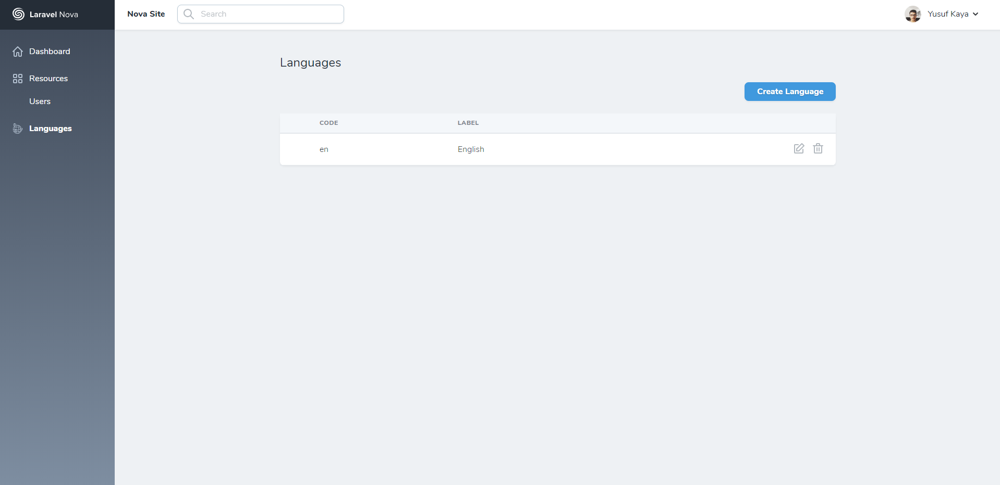

# Laravel Nova Dynamic Language

This tool is provide management the your language files by dynamical for your Nova application



## Installation

You can install the package into a Laravel app that uses Nova via composer:

```bash
composer install ysfkaya/nova-dynamic-lang
```

And you need to publish the migration and config files

```bash
php artisan vendor:publish --provider=Ysfkaya\NovaDynamicLang\DynamicLangProvider --tag=config,migrations
```

You must register the tool with Nova

```php
// in app/Providers/NovaServiceProvider.php

// ...

public function tools()
{
   return [
        // ...
        new Ysfkaya\NovaDynamicLang\DynamicLang(),
    );
}
```

## Configuration

- file_name : `frontend`

    We will create a file in your language files to save your fields.

- default_languages_path : `null` **only json file**

    If you want to use your languages then set path here. By default available languages will be used.

    **Example Json Data:**

    ```json
    [
         {
           "label": "A language label",
           "code": "A language code"
         }
    ]
    ```


## Usage

Select a store to default fields to save in config file


##### Rules (For Store : array,json)

| First Index | Second Index | Third Index |
| ------------- |:-------------:| -----:|
| Form Input Label | Form Input Value | Short Code for invoke |

#### Array store

Array store is provides you to quickly and simply set up your fields. Only usage the simply rules you can set the fields.

```php
// in config/nova-dynamic-lang.php

// ...

'array' => [
    'driver' => 'array',
    'fields' => [
        // ...
        ["Title","Title","title"],
        ["Description","Description","description"]
        // ...
    ],
],
```

#### Json store

Json store is also like an array store, but only a json file must be defined.

 **Note : "fields" key is required**


```php
// in config/nova-dynamic-lang.php

// ...

'json' => [
    'driver' => 'json',
    'path' =>   null // set a json file path,
],
```
In file :

```json
{
    "fields":[
        ["Title","Title","title"],
        ["Description","Description","description"]
    ]
}
```
#### Database store

Database store is management your fields by dynamical. It allows you use a nova resource. But you shouldn't modify table columns in migration file

```php
// in config/nova-dynamic-lang.php

// ...

'json' => [
    'driver' => 'database',
    'model' => \Ysfkaya\NovaDynamicLang\Models\LanguageSection::class // or you may use model instance of this model,
],
```


